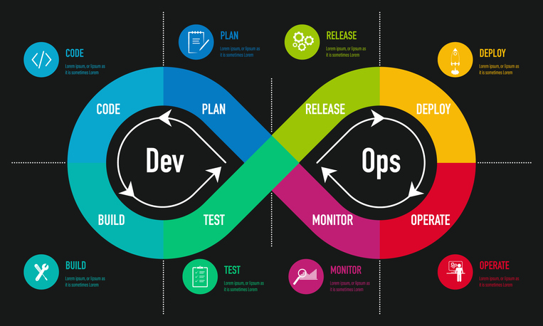

# Devops  

DevOps es un acrónimo inglés de development -desarrollo- y operations -operaciones- se refiere a un movimiento cultural y profesional centrado en la comunicación, colaboración e integración entre los desarrolladores de software y los profesionales en las operaciones de IT.

El término surgió por primera vez en la conferencia Agile 2008 Toronto en una charla sobre «Infraestructura Ágil«, donde Yhens Wasna y Patrick Debois hablaron de los malentendidos que surgían entre los equipos de desarrollo y sistemas que retrasaban la entrega de los proyectos. A partir de 2009 el término se popularizó debido a la celebración de los DevOps days en Bélgica, que luego se han replicado en varias ciudades del mundo.

## Índice ##
1. [Filosofía](Filosofía.md)
2. [Herramientas](Herramientas.md)
3. [Oferta de empleo](Oferta.md)

## Referencia ##

[DevOps](https://dpes.es/devops/)

